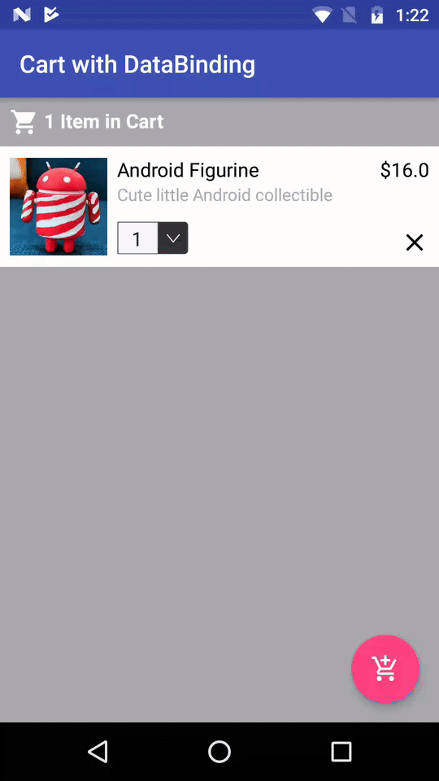

## Spinner Bindings

SpinnerBindings expounds on how we can bind a Spinner with DataBinding or InverseDataBinding.



## How to Use

[SpinnerExtensions](./app/src/main/java/com/chetdeva/spinnerbindings/extensions/SpinnerExtensions.kt) entails extension helper functions for Spinner that can be called from `BindingAdapter`.

```kotlin
    /**
     * set spinner entries
     */
    fun Spinner.setSpinnerEntries(entries: List<Any>?) {
        // ...
    }

    /**
     * set spinner onItemSelectedListener listener
     */
    fun Spinner.setSpinnerItemSelectedListener(listener: ItemSelectedListener?) {
        // ...
    }

    /**
     * set spinner onItemSelectedListener listener
     */
    fun Spinner.setSpinnerInverseBindingListener(listener: InverseBindingListener?) {
        // ...
    }

    /**
     * set spinner value
     */
    fun Spinner.setSpinnerValue(value: Any?) {
        // ...
    }

    /**
     * get spinner value
     */
    fun Spinner.getSpinnerValue(): Any? {
        // ...
    }
```

## How to Bind

In your `Gradle`

```groovy
    dataBinding {
        enabled = true
    }
```

### Using DataBinding

In your `BindingAdapter`

```kotlin
    @BindingAdapter("entries")
    fun Spinner.setEntries(entries: List<Any>?) {
        setSpinnerEntries(entries)
    }

    @BindingAdapter("onItemSelected")
    fun Spinner.setItemSelectedListener(itemSelectedListener: ItemSelectedListener?) {
        setSpinnerItemSelectedListener(itemSelectedListener)
    }

    @BindingAdapter("newValue")
    fun Spinner.setNewValue(newValue: Any?) {
        setSpinnerValue(newValue)
    }
```

In your `XML` file

```xml
<Spinner
    android:id="@+id/item_quantity_spinner"
    android:layout_width="wrap_content"
    android:layout_height="wrap_content"
    android:layout_marginStart="8dp"
    android:background="@drawable/ic_spinner_bg"
    android:gravity="center_vertical"
    android:paddingStart="4dp"
    android:textSize="16sp"
    app:entries="@{model.itemQuantityEntries}"
    app:layout_constraintBottom_toBottomOf="parent"
    app:layout_constraintStart_toEndOf="@id/item_image"
    app:newValue="@{model.itemQuantity}"
    app:onItemSelected="@{(newValue) -> presenter.onItemQuantityChange(model.cartItem, Converter.toInt(newValue))}" />
```

### Using InverseDataBinding

In your `BindingAdapter`

```kotlin
    @BindingAdapter("selectedValue")
    fun Spinner.setSelectedValue(selectedValue: Any?) {
        setSpinnerValue(selectedValue)
    }

    @BindingAdapter("selectedValueAttrChanged")
    fun Spinner.setInverseBindingListener(inverseBindingListener: InverseBindingListener?) {
        setSpinnerInverseBindingListener(inverseBindingListener)
    }

    companion object InverseSpinnerBindings {

        @JvmStatic
        @InverseBindingAdapter(attribute = "selectedValue", event = "selectedValueAttrChanged")
        fun Spinner.getSelectedValue(): Any? {
            return getSpinnerValue()
        }
    }
```

In your `XML` file

```xml
<Spinner
    android:id="@+id/item_quantity_spinner"
    android:layout_width="wrap_content"
    android:layout_height="wrap_content"
    android:layout_marginStart="8dp"
    android:background="@drawable/ic_spinner_bg"
    android:gravity="center_vertical"
    android:paddingStart="4dp"
    app:layout_constraintBottom_toBottomOf="parent"
    android:textSize="16sp"
    app:entries="@{model.itemQuantityEntries}"
    app:layout_constraintStart_toEndOf="@id/item_image"
    app:selectedValue="@={model.itemQuantity}" />
```

## Library used

Add Android DataBinding Compiler your `app` gradle file.

```groovy
    dependencies {
        kapt 'com.android.databinding:compiler:3.0.1'
    }
```

Make sure to apply `kotlin-kapt` plugin on top of your `app` gradle file.

```groovy
    apply plugin: 'kotlin-kapt'
```

## Also try

- [RecyclerView Bindings](https://github.com/chetdeva/recyclerview-bindings)
- [Swipeable RecyclerView](https://github.com/chetdeva/swipeablerecyclerview)
- [Draggable RecyclerView](https://github.com/chetdeva/draggablerecyclerview)

## Reference

- [Android Data Binding: 2-way Your Way](https://medium.com/google-developers/android-data-binding-2-way-your-way-ccac20f6313)

